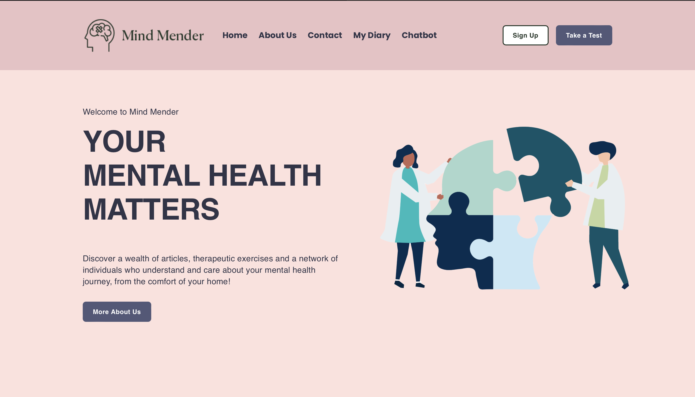
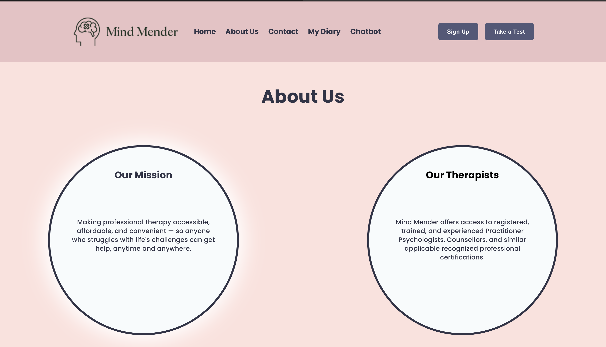
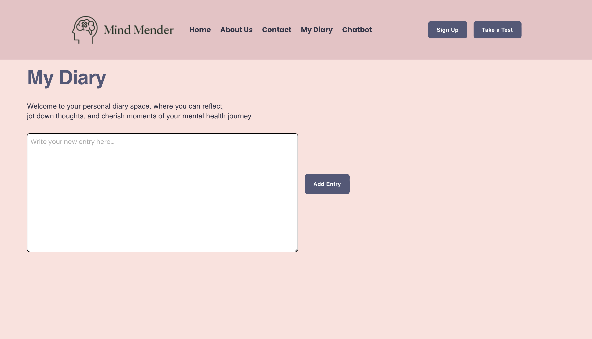
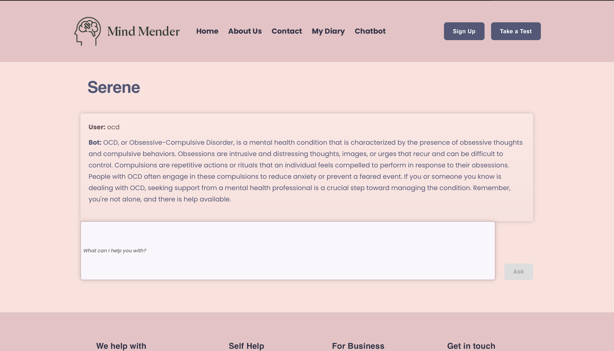
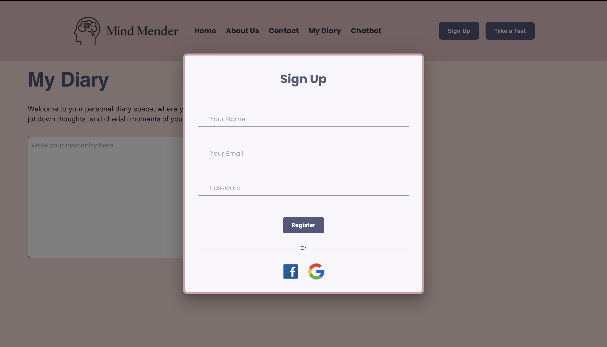

## Mind Mender - Your Mental Health Companion

###### Mind Mender is a comprehensive mental health website designed to provide valuable resources and support for individuals seeking guidance and assistance with their mental well-being. At the heart of Mind Mender is "Serene," an interactive chatbot dedicated to providing informative descriptions of various mental illnesses. Whether you're seeking to understand anxiety, depression, OCD, PTSD, or other mental health concerns, Serene offers insightful explanations to help users gain clarity and knowledge.

#### Therapy Introduction:

###### Explore our main page, where we introduce the concept of therapy and its benefits. Discover valuable insights into the different types of therapy available and how they can support your mental health journey.

#### About Us:

###### Visit our "About Us" page to learn more about Mind Mender and the services we offer. Gain an understanding of our mission, vision, and commitment to promoting mental well-being for all.

#### My Diary:

###### Keep track of your personal thoughts and experiences with our "My Diary" feature. Create, edit, and delete diary entries in a safe and private space, allowing you to reflect on your emotions and progress over time.

#### Serene Chatbot:

###### Engage with Serene, our friendly chatbot, to learn about different mental illnesses and their symptoms. Serene provides accurate and easy-to-understand descriptions, empowering users with knowledge about mental health conditions.

#### Sign Up:

###### Ready to take the next step in prioritizing your mental health? Click on the "Sign Up" button to access our registration modal and become a part of the Mind Mender community. Unlock additional features and personalized support tailored to your needs.

## Why Choose Mind Mender?

###### Mind Mender offers a user-friendly platform where individuals can access valuable information, support, and tools to enhance their mental well-being. With Serene as your guide, you can gain a deeper understanding of mental health conditions and take proactive steps towards self-care and healing. Whether you're embarking on your mental health journey for the first time or seeking additional resources, Mind Mender is here to support you every step of the way.

### Join Us Today

###### Take the first step towards prioritizing your mental health by exploring Mind Mender. Empower yourself with knowledge, find solace in our supportive community, and embark on a journey of self-discovery and healing. Together, we can nurture mental well-being and create a brighter, healthier future for all. Join us on Mind Mender today and embrace the power of mental wellness.
